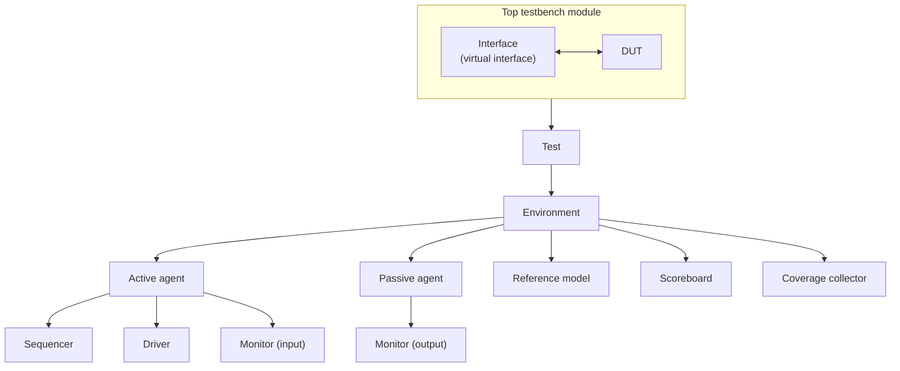
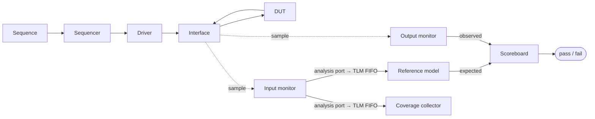

# digital-verify

digital-verify is a repository for verification-related work. Currently, it contains a single example,
`example/video`, a UVM (Universal Verification Methodology) SystemVerilog platform that verifies a
video-stream DUT along two parallel domains: pixel-data integrity and frame/row timing.

## Repository layout

```
digital-verify/
├── README.md
└── example/                          # Verification examples (more to be added)
    └── video/                        # Video-stream DUT UVM verification platform
```

## Examples

More examples and shared verification content will be added over time. The repository currently
contains one:

- **[`example/video`](example/video)** — Video verification platform. A reusable UVM architecture,
  demonstrated on a one-clock video-stream passthrough DUT and checked along two independent domains
  (pixel data and row/sync timing). See its [README](example/video/README.md) for the full
  architecture, directory layout, and conventions.

## UVM architecture & data flow

The examples in this repository share a common, layered UVM (Universal Verification Methodology)
structure. Understanding the generic roles and how transactions flow between them makes each example
easy to navigate.



### Component roles

- **Top module** — a static SystemVerilog module that instantiates the DUT and the interface, drives
  clock and reset, and starts the test with `run_test`.
- **Interface** — bundles the DUT signals and a clocking block. It is shared with the class-based
  components as a **virtual interface** handle, so drivers and monitors reach the pins without direct
  hierarchical references.
- **Configuration object** — a plain object that carries the virtual interface, DUT parameters, and
  feature enables. It is distributed top-down through `uvm_config_db`.
- **Test** — the top of the class hierarchy. It reads the configuration, builds the environment, and
  starts the stimulus sequences.
- **Environment (env)** — a container that instantiates the agents, reference model, scoreboard, and
  coverage collector, and wires them together.
- **Agent** — groups the components for one interface. An **active** agent contains a sequencer,
  driver, and monitor and drives stimulus; a **passive** agent contains only a monitor and observes.
  - **Sequence / sequence_item** — the stimulus description and the transaction it produces.
  - **Sequencer** — arbitrates sequences and hands transactions to the driver.
  - **Driver** — converts transactions into pin activity through the interface.
  - **Monitor** — samples the interface and publishes observed transactions on an analysis port.
- **Reference model** — computes the expected DUT behavior.
- **Scoreboard** — compares observed output against the expected output and reports pass/fail.
- **Coverage collector** — records functional coverage from observed transactions.

### Data flow

Transactions move along four paths. Producers publish on a `uvm_analysis_port`; the port feeds a TLM
FIFO; consumers pull through get-ports, which keeps the components decoupled.



1. **Stimulus** — the test starts a sequence on the sequencer; the sequencer passes sequence_items to
   the driver, which drives them onto the interface and into the DUT.
2. **Observation** — monitors on the input and output sides sample the interface and broadcast the
   observed transactions on their analysis ports.
3. **Checking** — the reference model turns input transactions into expected results; the scoreboard
   compares the observed output against that expectation.
4. **Coverage** — observed transactions are also sampled by the coverage collector.

For a concrete instantiation of this architecture — including the specific component set, the module
hierarchy, and how a DUT is split into independent verification domains — see the
[`example/video` README](example/video/README.md).

## Roadmap

- Additional verification examples beyond `example/video`.
- Shared, reusable verification content (common components, references) factored out across examples.
- Richer functional coverage in the video example (currently a reference stub).
