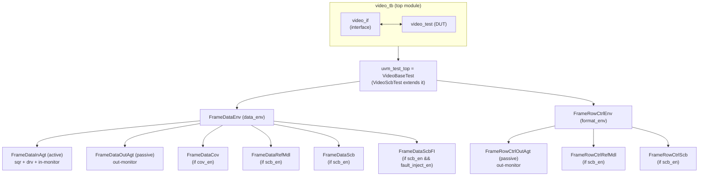

# Video Verification Platform

`example/video` is a UVM (Universal Verification Methodology) SystemVerilog verification platform for a
video-stream DUT. It captures a **reusable architecture** in which each independent aspect of the DUT
is verified by its own self-contained set of UVM components, all driven from a single shared interface
and configuration object and orchestrated by a thin test layer. The DUT is checked along two parallel
domains: pixel-data integrity (`FrameData`) and frame/row timing (`FrameRowCtrl`).

## Directory layout

```
video/
├── src/
│   └── video_test.v              # DUT (Verilog): one-clock video passthrough
└── tb/
    ├── video_if.sv               # Video interface + modports (virtual interface)
    ├── video_tb.sv               # Top testbench module (clock/reset, DUT + IF, run_test)
    └── class/
        ├── video_tb_pkg.sv       # UVM package: `include order for all classes
        ├── FrameConfig.sv        # Frame timing config object
        ├── VideoConfig.sv        # Central config object (vif, timing, enables)
        ├── VideoBaseTest.sv      # Base uvm_test
        ├── VideoScbTest.sv       # Scoreboard self-check test (fault injection)
        ├── FrameData/            # Domain 1: pixel-data value + latency
        │   ├── FrameDataTxn.sv       # sequence_item (frame of pixels)
        │   ├── FrameDataSqr.sv       # sequencer
        │   ├── FrameDataDrv.sv       # driver
        │   ├── FrameDataBaseSeq.sv   # sequence
        │   ├── FrameDataInMon.sv     # input monitor
        │   ├── FrameDataOutMon.sv    # output monitor
        │   ├── FrameDataInAgt.sv     # input agent (active)
        │   ├── FrameDataOutAgt.sv    # output agent (passive)
        │   ├── FrameDataRefMdl.sv    # reference model
        │   ├── FrameDataScb.sv       # scoreboard
        │   ├── FrameDataScbFI.sv     # scoreboard fault injector
        │   ├── FrameDataCov.sv       # coverage collector
        │   └── FrameDataEnv.sv       # environment
        └── FrameRowCtrl/         # Domain 2: row/sync timing (de/hsync/vsync)
            ├── FrameRowCtrlTxn.sv    # sequence_item (one row of control signals)
            ├── FrameRowCtrlOutMon.sv # output monitor
            ├── FrameRowCtrlOutAgt.sv # output agent (passive)
            ├── FrameRowCtrlRefMdl.sv # reference model (golden timing generator)
            ├── FrameRowCtrlScb.sv    # scoreboard
            └── FrameRowCtrlEnv.sv    # environment
```

## Architecture

The platform is organized so that shared infrastructure is defined once and each verification
**domain** is an independent, pluggable component set.

### Shared infrastructure

- **One virtual interface.** A single parameterized `interface` (`video_if #(DATA_WIDTH,
  PIXEL_PER_CLOCK)`) carries the DUT IO, a clocking block, a free-running timestamp counter
  (`clk_cnt`), and per-role modports (`drv_mp` for the driver, `mon_mp` for monitors). It is passed to
  components as a virtual interface handle inside the config object.
- **Layered configuration.** A central config object (`VideoConfig`) bundles the virtual interface,
  a nested timing config (`FrameConfig`), the expected DUT latency, driver activeness, and the feature
  enables. The top module publishes it to `uvm_test_top` via `uvm_config_db`; the test re-publishes it
  to each env; each env re-publishes it to its agents; each agent re-publishes it to its children.

### Per-domain component sets

Each domain that must be checked independently is implemented as a full UVM component set. Depending
on whether the domain drives stimulus or only observes, it uses some or all of the standard roles:

- **sequence_item** — the transaction (e.g. a frame of pixels, or one row of control signals).
- **sequence** — generates and sends transactions to the sequencer.
- **sequencer** — arbitrates sequences onto the driver.
- **driver** — converts transactions into pin wiggles through the interface clocking block.
- **monitor(s)** — sample the interface (input and/or output side) into transactions and broadcast
  them on an analysis port, timestamping each with `clk_cnt`.
- **agent(s)** — package a monitor with an optional sequencer + driver; an active agent drives and
  monitors, a passive agent only monitors.
- **reference model** — produces the expected output (from observed input, or as a free-running
  golden generator derived from config).
- **scoreboard** — compares observed output against expected, and checks latency using timestamps.
- **scoreboard fault injector** — optionally corrupts the observed output so a self-check test can
  confirm the scoreboard actually catches mismatches.
- **coverage collector** — samples transactions into covergroups.
- **env** — instantiates the components of one domain and wires them together.

### Data-path convention

Producers broadcast on a `uvm_analysis_port`; the port feeds a `uvm_tlm_analysis_fifo` (or
`uvm_tlm_fifo` for model→scoreboard); consumers pull through blocking / non-blocking get-ports. The
sequencer↔driver link uses the standard `seq_item_port`/`seq_item_export`. This keeps every component
decoupled — connections live only in the env's `connect_phase`.

### Config-driven feature enables

Feature flags on the config object switch whole component subtrees on or off in the env's
`build_phase` / `connect_phase`:

- `scb_en` — build the reference model + scoreboard and their FIFOs.
- `cov_en` — build the coverage collector.
- `fault_inject_en` — insert the fault injector between the output agent and the scoreboard.

### Test-layer orchestration

A base test gets the config, fills in the concrete parameters (timing, latency, activeness),
distributes it to the envs, builds the envs, and starts the stimulus sequence. A self-check test
extends the base test, enables fault injection, and **inverts the pass/fail logic** — injected faults
that raise scoreboard errors mean the scoreboard works; zero errors means it failed to catch them.

### Component hierarchy



## DUT and verification domains

- **DUT** — `src/video_test.v`, a minimal Verilog video passthrough with exactly one clock of
  latency: each clock it registers the input video bus (`vin_*`) onto the output bus (`vout_*`). It is
  a placeholder that lets the platform be exercised end-to-end (expected latency = 1, output pixels
  identical to input).
- **FrameData domain** — verifies the **pixel content and latency**. The stimulus sequence drives a
  generated color-bar frame followed by a frame loaded from a binary file. Input and output monitors
  sample the pixel bus; the reference model copies the input (modeling the passthrough); the
  scoreboard checks pixel-value equality and that the output arrives `ref_latency` clocks after the
  input.
- **FrameRowCtrl domain** — verifies the **row/sync timing** (`de`, `hsync`, `vsync`). Its reference
  model is a free-running golden generator that produces the expected waveform for every row directly
  from `FrameConfig`; the scoreboard compares the observed output rows against it.
- **Tests** — `VideoBaseTest` runs the stimulus and reports PASS/FAIL from the UVM error count.
  `VideoScbTest` enables fault injection, disables coverage, and inverts the verdict to prove the
  scoreboard catches injected errors.

## Naming & file conventions

- **One class per file**, with a PascalCase filename that matches the class name
  (e.g. `FrameDataScb.sv` contains `FrameDataScb`). A domain's component set lives in its own
  subdirectory under `tb/class/` (`FrameData/`, `FrameRowCtrl/`).
- **Include order is centralized** in `video_tb_pkg.sv`: config objects first, then each domain's set
  in dependency order (txn → sqr → drv → monitors → agents → ref model → scoreboard → fault injector →
  coverage → env → sequence), then the tests.
- **Parameterization** — most classes are parameterized on `#(DATA_WIDTH, PIXEL_PER_CLOCK)`. A few
  that do not touch the packed-pixel width are narrower: `FrameDataTxn`, `FrameDataRefMdl`, and
  `FrameDataScbFI` take only `#(DATA_WIDTH)`, while `FrameRowCtrlTxn` and `FrameRowCtrlScb` are
  non-parameterized. The test's local `PIXEL_PER_CLOCK` must match the `video_tb` parameter.
